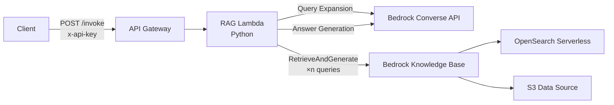

[日本語](README.md) | English

# Query Expansion RAG API on CDK

## Overview

This project is a CDK project for deploying a Query Expansion RAG (Retrieval-Augmented Generation) API leveraging AWS Bedrock Knowledge Base using the AWS Cloud Development Kit (CDK).

Key features include:

- Deploy multiple RAG applications with different specifications from a single codebase, simply by changing configuration files.
- Implements the entire RAG pipeline (query expansion, knowledge base retrieval, relevance evaluation, answer generation) in Lambda functions.
- Provides a secure, externally accessible API endpoint by integrating API Gateway and Lambda.

## Architecture

This application consists of the following major components:



1.  **API Gateway**: Receives requests from external sources and performs authentication using the `x-api-key` header.
2.  **RAG Lambda (Python)**: A Python Lambda function triggered by requests from API Gateway. Implements RAG processing including query expansion, KB retrieval, relevance evaluation, and answer generation.
3.  **Bedrock Converse API**: Used for query expansion and answer generation.
4.  **Knowledge Base**: Bedrock Knowledge Base. Uses OpenSearch Serverless as the backend for vector search of documents.

### Encryption and Security

This project uses KMS Customer Managed Encryption Keys (CMEK) to protect data.

**Individual CMEK approach**:
- Each RAG API has its own KMS encryption key
- Enables irreversible data deletion on a per-API (RAG index) basis by deleting the corresponding KMS encryption key

**Shared CMEK approach**:
- Multiple RAG APIs share a single common KMS encryption key (SharedCmekStack)
- Efficiently utilizes OpenSearch Serverless Collection OCU (capacity units)

**Common configuration**:
- S3 buckets, OpenSearch Collections, and CloudWatch Logs are all encrypted with the same key
- Key rotation is automatically enabled
- Keys are retained even after Stack deletion (RemovalPolicy.RETAIN)

## Project Structure

The roles of major files and directories are as follows:

- `bin/qe-rag-apis.ts`: Entry point of the CDK application.
- `lib/`: CDK stack and construct definitions.
    - `shared-cmek-stack.ts`: Shared CMEK Stack definition (KMS keys shared by multiple APIs).
    - `rag-knowledge-base-stack.ts`: RAG Knowledge Base and OpenSearch Collection definitions.
    - `rag-lambda-api-stack.ts`: API Gateway and Lambda function definitions.
    - `switch-role-stack.ts`: IAM SwitchRole definition.
    - `stack-input.ts`: Configuration schema definition (Zod).
- `config/`: Storage location for application configuration files.
    - `apps/`: Individual configurations for each application (TOML files).
- `custom-resources/`: Code for Lambda functions used as CDK custom resources.
- `cdk.json`: Definition of applications to be deployed and CDK context settings.
- `parameter.ts`: Logic for reading `cdk.json` and `.toml` files and merging configurations.

## Configuration

This project allows flexible deployment content changes through configuration combinations. Configuration is managed at the following three levels:

1.  **`cdk.json`**: Top-level configuration defining the list of applications to deploy.
2.  **`parameter.ts`**: Intermediate configuration absorbing differences between environments such as `-dev`, `-stg`, and `-prd`.
3.  **`config/apps/*.toml`**: Individual configuration defining detailed parameters for each application.

#### Steps to Add a New Application

1.  **Define the application in `cdk.json`**

    **Individual CMEK approach**: Add to the `qeRagAppNames` array. Each API manages its own KMS encryption key, allowing you to delete the key individually to make the corresponding cloud data cryptographically irrecoverable.

    ```json
    // cdk.json
    "qeRagAppNames": [
      {"appName": "easy", "appParamFile": "easy.toml"},
      // ... existing apps
      {"appName": "my-new-app", "appParamFile": "my-new-app.toml"} // <-- Add new app
    ],
    ```

    **Shared CMEK approach**: Add to the `qeRagAppNamesWithSharedCmek` array. Multiple APIs share a common KMS encryption key and efficiently utilize OpenSearch Serverless OCU (capacity units).

    ```json
    // cdk.json
    "qeRagAppNamesWithSharedCmek": [
      {"appName": "new-api-1", "appParamFile": "new-api-1.toml"},
      {"appName": "new-api-2", "appParamFile": "new-api-2.toml"} // <-- Use shared CMEK
    ],
    ```

    **Important**: App names must not overlap between `qeRagAppNames` and `qeRagAppNamesWithSharedCmek`. If overlap is detected, an error will occur before deployment.

2.  **Create an individual configuration file in `config/apps/`**

    Create a `.toml` file in the `config/apps/` directory with the name specified above. In this file, describe **only the items you want to change from the default configuration**.

    ```toml
    # config/apps/my-new-app.toml

    # Application name
    name = "my-new-app"
    description = "My new RAG application"

    # Override answer generation settings
    [answer_generation]
    # Change model to Claude 3 Sonnet
    modelId = "anthropic.claude-3-5-sonnet-20240620-v1:0"
    # Customize system prompt
    systemPrompt = '''
    You are an excellent assistant. Please answer faithfully based on the provided information.
    '''
    # Change inference parameters
    temperature = 0.1
    ```

    - **Configuration override logic**:
        - Items described in the individual configuration file in `config/apps/` override the default configuration in `config/defaults/`.
        - For items not described in the individual configuration file, the values from the default configuration are automatically applied.

#### IP Address Restriction Configuration

This API can use AWS WAF to restrict access by IP address. Configuration is done for each environment.

1.  **Edit `parameter.ts`**

    In the `deploy_envs` object in the `parameter.ts` file, describe `allowedIpV4AddressRanges` or `allowedIpV6AddressRanges` in CIDR format for each environment (`-dev`, `-stg`, `-prd`, etc.).

    ```typescript
    // parameter.ts
    const deploy_envs: Record<string, Partial<StackInput>> = {
      "-dev": {
        // Allow access only from development environment
        allowedIpV4AddressRanges: [
          "192.168.0.0/32",
          "192.168.0.1/32",
        ],
      },
      "-stg": {
        // Allow access only from staging environment
        allowedIpV4AddressRanges: [
          "192.168.1.0/32",
          "192.168.1.1/32",
        ],
      },
      // ...
    };
    ```

2.  **Deploy**

    Save the file and run `cdk deploy --all -c env=-dev` to apply WAF rules to API Gateway that allow access only from the specified IP addresses.

## Configuration Reference

- [App configuration sample (TOML)](./config/apps/qerag.toml)
- [Default configuration](./config/defaults/)

## Deployment Steps

#### 1. Prerequisites
- AWS CLI
- Node.js (v22.x)
- AWS CDK

#### 2. Install Dependencies
Run `npm ci` at the project root. With npm workspaces, dependencies for `custom-resources` are also automatically installed.

```bash
# Project root (all dependencies will be installed with this single command)
npm ci
```

**Note**: Previously, individual installation in the `custom-resources` directory was required, but this is no longer necessary with the introduction of npm workspaces.

#### 3. CDK Bootstrap
Run once for each AWS environment (account/region) where you deploy this CDK for the first time.

```bash
cdk bootstrap
```

#### 4. Execute Deployment
After editing configuration files (`cdk.json`, `config/apps/*.toml`), deploy with the following command.

```bash
# Deploy with environment specified (recommended)
cdk deploy --all -c env=-dev     # Development environment
cdk deploy --all -c env=-stg     # Staging environment
cdk deploy --all -c env=-prd     # Production environment
```

## How to Use the API

When deployment is complete, the API endpoint and API key retrieval command are displayed as CDK output.

1.  **Get API Key**:
    Use the output `ApiKeyId` to get the API key with the following command.
    ```bash
    aws apigateway get-api-key --api-key <ApiKeyId> --include-value --query value --output text
    ```

2.  **Execute API**:
    Set the obtained API key in the `x-api-key` header and send a POST request to the `/invoke` endpoint.

    ```bash
    # Set API endpoint and API key as environment variables
    API_ENDPOINT="<Your ApiEndpoint from CDK output>"
    API_KEY="<Your ApiKeyValue from previous step>"

    # Execute API request
    curl -X POST "$API_ENDPOINT" \
      -H "Content-Type: application/json" \
      -H "x-api-key: $API_KEY" \
      -d '{
        "inputs": {
          "question": "Please tell me about flextime systems.",
          "n_queries": 3,
          "output_in_detail": false
        }
      }'
    ```

    **Request Parameters**:

    | Parameter | Type | Required | Description |
    |---|---|---|---|
    | `inputs.question` | string | ✅ | User's question text |
    | `inputs.n_queries` | number | | Number of query expansions (default: 3) |
    | `inputs.output_in_detail` | boolean | | Detailed answer mode (default: false) |

## Acknowledgments

The base implementation of this API was developed by the AWS Prototyping Program team.
Following additional development and production deployment by the Digital Agency, Government of Japan, it has been released as open source software.

We gratefully acknowledge the significant contributions of the AWS Prototyping Program developers.
