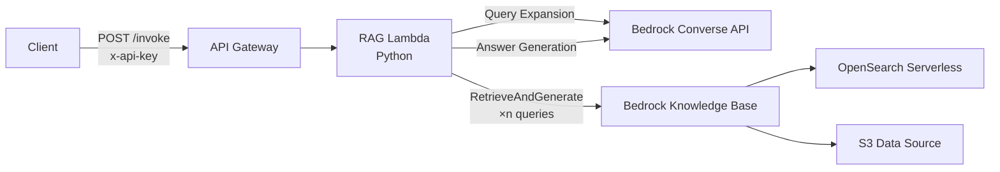

日本語 | [English](README.en.md)

# Query Expansion RAG API on CDK

## 概要

このプロジェクトは、デジタル庁 [genai-ai-api](https://github.com/digital-go-jp/genai-ai-api) をプライベートサブネットのみの閉域環境で動作するように CDK を一部改変したものです。

このプロジェクトは、AWS Cloud Development Kit (CDK) を利用して、AWS Bedrock Knowledge Base を活用したクエリ拡張 RAG (Retrieval-Augmented Generation) API をデプロイするための CDK プロジェクトです。

主な特徴は以下の通りです。

- 設定ファイルを変更するだけで、複数の異なる仕様を持つRAGアプリケーションを一つのコードベースから並行してデプロイできます。
- クエリ拡張、ナレッジベース検索、関連性評価、回答生成といった一連のRAG処理をLambda関数で実装しています。
- API GatewayとLambdaを統合し、外部から安全に利用可能なAPIエンドポイントを提供します。

このプロジェクト内のドキュメントは、デジタル庁 [genai-ai-api](https://github.com/digital-go-jp/genai-ai-api) を元に改変したものでライセンスは CC BY 4.0 のもとで提供されています。

## アーキテクチャ

このアプリケーションは、以下の主要コンポーネントで構成されています。



1.  **API Gateway**: 外部からのリクエストを受け付け、`x-api-key`ヘッダーによる認証を行います。
2.  **RAG Lambda (Python)**: API Gatewayからのリクエストをトリガーに実行されるPython Lambda関数。クエリ拡張・KB検索・関連性評価・回答生成のRAG処理を実装しています。
3.  **Bedrock Converse API**: クエリ拡張および回答生成に使用します。
4.  **Knowledge Base**: Bedrock Knowledge Base。ドキュメントをベクトル検索するバックエンドとしてOpenSearch Serverlessを使用します。

### 暗号化とセキュリティ

このプロジェクトでは、データ保護のためにKMS Customer Managed Encryption Key (CMEK)を使用しています。

**個別CMEK方式**:
- 各RAG APIが独自のKMS暗号化キーを持ちます
- KMS暗号化キーを削除することによる復元不能化をAPI（RAGインデックス）個別に実施可能です

**共通CMEK方式**:
- 複数のRAG APIが1つの共通KMS暗号化キー（SharedCmekStack）を共有します
- OpenSearch Serverless CollectionのOCU（容量単位）を効率的に利用できます

**共通の設定**:
- S3バケット、OpenSearch Collection、CloudWatch Logsがすべて同じキーで暗号化されます
- キーローテーションが自動的に有効化されます
- Stackを削除してもキーは保持されます（RemovalPolicy.RETAIN）

## プロジェクト構造

主要なファイルとディレクトリの役割は以下の通りです。

- `bin/qe-rag-apis.ts`: CDKアプリケーションのエントリーポイント。
- `lib/`: CDKスタックとコンストラクトの定義。
    - `shared-cmek-stack.ts`: 共通CMEK Stackの定義（複数APIで共有されるKMSキー）。
    - `rag-knowledge-base-stack.ts`: RAG Knowledge BaseとOpenSearch Collectionの定義。
    - `rag-lambda-api-stack.ts`: API GatewayとLambda関数の定義。
    - `switch-role-stack.ts`: IAM SwitchRoleの定義。
    - `stack-input.ts`: 設定スキーマの定義（Zod）。
- `config/`: アプリケーション設定ファイルの格納場所。
    - `apps/`: アプリケーションごとの個別設定（TOMLファイル）。
- `custom-resources/`: CDKのカスタムリソースとして利用されるLambda関数のコード。
- `cdk.json`: デプロイ対象アプリケーションの定義やCDKのコンテキスト設定。
- `parameter.ts`: `cdk.json`や`.toml`ファイルを読み込み、設定をマージするロジック。

## 設定方法

このプロジェクトでは、設定の組み合わせによってデプロイ内容を柔軟に変更できます。設定は以下の3階層で管理されます。

1.  **`cdk.json`**: デプロイするアプリケーションのリストを定義する最上位の設定。
2.  **`parameter.ts`**: `-dev`, `-stg`, `-prd` といった環境ごとの差分を吸収する中間設定。
3.  **`config/apps/*.toml`**: アプリケーションごとの詳細なパラメータを定義する個別設定。

#### 新しいアプリケーションを追加する手順

1.  **`cdk.json`にアプリケーションを定義する**

    **個別CMEK方式**: `qeRagAppNames`配列に追加します。各APIが独自のKMS暗号化キーを持ちます。APIごとに個別にKMS暗号化キーを管理することができるので、データ削除後にクラウド上のデータを復元不能にするための暗号化キー削除を個別に実施可能です。

    ```json
    // cdk.json
    "qeRagAppNames": [
      {"appName": "easy", "appParamFile": "easy.toml"},
      // ... existing apps
      {"appName": "my-new-app", "appParamFile": "my-new-app.toml"} // <-- 新しいアプリを追加
    ],
    ```

    **共通CMEK方式**: `qeRagAppNamesWithSharedCmek`配列に追加します。複数のAPIが共通のKMS暗号化キーを共有し、OpenSearch ServerlessのOCU（容量単位）を効率的に利用できます。

    ```json
    // cdk.json
    "qeRagAppNamesWithSharedCmek": [
      {"appName": "new-api-1", "appParamFile": "new-api-1.toml"},
      {"appName": "new-api-2", "appParamFile": "new-api-2.toml"} // <-- 共通CMEKを使用
    ],
    ```

    **重要**: `qeRagAppNames`と`qeRagAppNamesWithSharedCmek`の間でアプリ名が重複してはいけません。重複が検出された場合、デプロイ前にエラーが発生します。

2.  **`config/apps/`に個別設定ファイルを作成する**

    `config/apps/`ディレクトリに、上記で指定した名前で`.toml`ファイルを作成します。このファイルには、**デフォルト設定から変更したい項目だけ**を記述します。

    ```toml
    # config/apps/my-new-app.toml

    # アプリケーション名
    name = "my-new-app"
    description = "私の新しいRAGアプリケーション"

    # 回答生成の設定を上書き
    [answer_generation]
    # モデルをClaude 3 Sonnetに変更
    modelId = "anthropic.claude-3-5-sonnet-20240620-v1:0"
    # システムプロンプトをカスタマイズ
    systemPrompt = '''
    あなたは優秀なアシスタントです。提供された情報を元に、誠実に回答してください。
    '''
    # 推論パラメータを変更
    temperature = 0.1
    ```

    - **設定の上書きロジック**:
        - `config/apps/`の個別設定ファイルに記述された項目は、`config/defaults/`のデフォルト設定を上書きします。
        - 個別設定ファイルに記述がない項目は、デフォルト設定の値が自動的に適用されます。

#### ネットワーク構成（Private API）

このAPIは Private API Gateway として、プライベートサブネットのみを持つ VPC にデプロイされます。`NetworkStack` が VPC・プライベートサブネット・各種 VPC エンドポイント（`bedrock-runtime`, `bedrock-agent-runtime`, `kms`, `logs`, `execute-api`, `s3`）を作成し、Lambda はプライベートサブネットに配置されます。

API Gateway はリソースポリシーで `aws:SourceVpce` を `execute-api` の VPC エンドポイントに限定しているため、同一 VPC・VPC peering 経由・VPN/Direct Connect 経由のクライアントからのみアクセス可能です。

VPC の CIDR を変更する場合は `cdk.json` の `vpcCidr` を編集してください（デフォルト: `10.130.0.0/20`）。

#### その他

`cdk.json` 内の `switchRoleName` を実際に存在する IAM Role 名を設定してください。（CDK でこの IAM Role を参照するリソースの作成に失敗するため。）

## 設定リファレンス

- [アプリ設定サンプル（TOML）](./config/apps/qerag.toml)
- [デフォルト設定](./config/defaults/)

## デプロイ手順

#### 1. 前提条件
- AWS CLI
- Node.js (v22.x)
- AWS CDK

#### 2. 依存関係のインストール
プロジェクトルートで`npm ci`を実行します。npm workspacesにより、`custom-resources`の依存関係も自動的にインストールされます。

```bash
# プロジェクトルート（このコマンド一回で全ての依存関係がインストールされます）
npm ci
```

**注**: 以前は`custom-resources`ディレクトリで個別にインストールが必要でしたが、npm workspacesの導入により不要になりました。

#### 3. CDKブートストラップ
初めてこのCDKをデプロイするAWS環境（アカウント/リージョン）で一度だけ実行します。

```bash
cdk bootstrap
```

#### 4. デプロイの実行
設定ファイル（`cdk.json`, `config/apps/*.toml`）を編集した後、以下のコマンドでデプロイします。

```bash
# 環境を指定してデプロイ（推奨）
cdk deploy --all -c env=-dev     # 開発環境
cdk deploy --all -c env=-stg     # ステージング環境
cdk deploy --all -c env=-prd     # 本番環境
```

## APIの利用方法

デプロイが完了すると、CDKの出力としてAPIエンドポイントとAPIキー取得コマンドが表示されます。

1.  **APIキーの取得**:
    出力された`ApiKeyId`を使って以下のコマンドでAPIキーを取得します。
    ```bash
    aws apigateway get-api-key --api-key <ApiKeyId> --include-value --query value --output text
    ```

2.  **APIの実行**:
    取得したAPIキーを`x-api-key`ヘッダーに設定し、`/invoke`エンドポイントにPOSTリクエストを送信します。

    ```bash
    # APIエンドポイントとAPIキーを環境変数に設定
    API_ENDPOINT="<Your ApiEndpoint from CDK output>"
    API_KEY="<Your ApiKeyValue from previous step>"

    # APIリクエストの実行
    curl -X POST "$API_ENDPOINT" \
      -H "Content-Type: application/json" \
      -H "x-api-key: $API_KEY" \
      -d '{
        "inputs": {
          "question": "フレックスタイム制について教えてください。",
          "n_queries": 3,
          "output_in_detail": false
        }
      }'
    ```

    **リクエストパラメータ**:

    | パラメータ | 型 | 必須 | 説明 |
    |---|---|---|---|
    | `inputs.question` | string | ✅ | ユーザーの質問テキスト |
    | `inputs.n_queries` | number | | クエリ拡張数（デフォルト: 3） |
    | `inputs.output_in_detail` | boolean | | 詳細回答モード（デフォルト: false） |

## 謝辞

本APIのベースとなる実装は、AWS Prototyping Program の開発者によって作成されました。
その後、デジタル庁による追加開発および実運用を経て、オープンソースソフトウェアとして公開するに至りました。

AWS Prototyping Program の開発者の皆様の多大なる貢献に、深く感謝申し上げます。