# このリポジトリの目的と構成

## 目次

- [このリポジトリの目的と構成](#このリポジトリの目的と構成)
- [利用の前提](#利用の前提)
  - [ツールインストール](#ツールインストール)
  - [リソースプロバイダーの登録](#リソースプロバイダーの登録)
  - [クォータや利用可能なゾーンの確認](#クォータや利用可能なゾーンの確認)
- [利用手順](#利用手順)
  - [1. 本リポジトリのダウンロード](#1-本リポジトリのダウンロード)
  - [2. パラメータの設定](#2-パラメータの設定)
  - [3. Azure Developer CLIのログイン](#3-azure-developer-cliのログイン)
  - [4. デプロイ](#4-デプロイ)
  - [5. VMSS 自動 起動/停止の設定](#5-vmss-自動-起動停止の設定)
- [環境の削除](#環境の削除)
- [vLLM API - API仕様](#vllm-api---api仕様)
  - [APIモードの切り替え](#apiモードの切り替え)
  - [変換モード（enablePlamoCustomApiTransform = true）](#変換モードenableplamocustomapitransform--true)
  - [パススルーモード（enablePlamoCustomApiTransform = false）](#パススルーモードenableplamocustomapitransform--false)
- [Azure OpenAI 直接API - API仕様](#azure-openai-直接api---api仕様)
  - [エンドポイント1: Chat Completions API](#エンドポイント1-chat-completions-api)
  - [エンドポイント2: Responses API](#エンドポイント2-responses-api)
- [Azure OpenAI Code Interpreter - API仕様](#azure-openai-code-interpreter---api仕様)
- [メトリクスやログについて](#メトリクスやログについて)
- [VMSS VMへのアクセスとトラブルシューティング](#vmss-vmへのアクセスとトラブルシューティング)
  - [VMへのアクセス準備](#vmへのアクセス準備)
  - [トラブルシューティング](#トラブルシューティング)
    - [CUDA ドライバー/ランタイム不整合エラー](#cuda-ドライバーランタイム不整合エラー)
- [参考情報](#参考情報)
  - [APIMポリシーカスタマイズガイド](#apimポリシーカスタマイズガイド)
  - [vLLMコンテナへのPythonライブラリ追加](#vllmコンテナへのpythonライブラリ追加)
  - [第三者ライセンス](#第三者ライセンス)

---

本リポジトリは、vLLMに対応しているHugging FaceモデルやAzure OpenAIのモデルをMicrosoft Azure上で効率的にホスティングし、APIとして提供するためのテンプレートです。

アーキテクチャは以下の通りです。

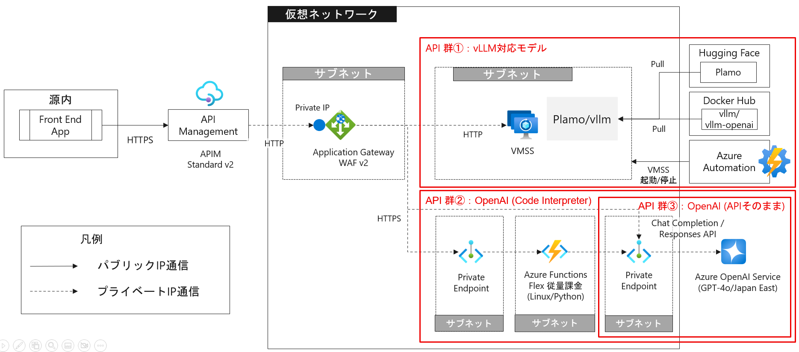

このアーキテクチャは、以下のMicrosoft Azureサービスで構成されています。


**共通**
*   **Azure API Management (APIM):**
    外部からのリクエストを受け付ける単一のエンドポイントを提供します。接続元IP制限、APIキーによる認証やリクエストのルーティングを担当します。受け取ったリクエストは仮想ネットワークを通してプライベートIP通信でAPGWへHTTPでリクエストします。
*   **Azure Application Gateway (APGW):**
    APIMからのリクエストを受け取り、バックエンドの推論用のVMに負荷分散します。APIMのBackendの認可資格情報でx-apim-secretヘッダを追加してAPGWにリクエストし、APGWのWAFポリシーでx-apim-secretヘッダを検証する仕組みにしています。これにより、APGWがリクエスト受け付け可能なAPIMを制限しています。

**vLLM対応モデル API 群**
* **Virtual Machine Scale Set (VMSS) / Virtual Machine (VM):**
    Hugging Faceから推論対象のモデルを取得し、REST APIで推論可能な推論コンテナを作成し、稼働させます。推論コンテナは、VMSSの構成としているため、VMを追加するだけで柔軟にスケール可能です。
*   **Azure Automation:**
    VMを定期的に起動 / 停止します。

**OpenAI API群**
* **Azure Functions**
    Azure OpenAIの一連のAPIを実行し、処理全体をオーケストレートするサーバーレス実行環境です。Azure OpenAI への通信については、プライベートエンドポイント経由で閉域アクセスとなります。
* **Azure OpenAI Service**
    OpenAI APIを提供します。Code InterpreterによるExcel/CSVファイルのデータ分析機能用のAPIとChat Completions/Responses APIを提供します。

> **Note:**   
> vLLMとは、大規模言語モデル（LLM）の推論を高速化するためのオープンソースエンジンです。    
>  [Github Repos : vllm-project/vllm](https://github.com/vllm-project/vllm)   
> [Doc : vLLM](https://docs.vllm.ai/en/latest/)   
> vllm/vllm-openaiというDockerイメージを使用すれば、コマンド一つでHugging Faceの人気モデルをOpenAI互換のAPIで使用することができます。    
> [Doc : Using Docker](https://docs.vllm.ai/en/stable/deployment/docker.html)   
> vLLMでサポートしているモデルは次の通りです。   
> [Doc : Supported Models](https://docs.vllm.ai/en/latest/models/supported_models.html)

# 利用の前提

## ツールインストール

次のツールをインストールしてください。

[Azure Developer CLI](https://learn.microsoft.com/ja-jp/azure/developer/azure-developer-cli/install-azd)

[Azure CLI](https://learn.microsoft.com/ja-jp/cli/azure/install-azure-cli?view=azure-cli-latest)

## リソースプロバイダーの登録

本テンプレートを使用する前に、必要なAzureリソースプロバイダーが登録されていることを確認してください。

### Azure Portalでの確認・登録手順

1. [Azure Portal](https://portal.azure.com)にログインします。

2. 検索バーに「サブスクリプション」と入力し、**サブスクリプション**を選択します。

3. 使用するサブスクリプションをクリックします。

4. 左側のメニューから**設定** > **リソース プロバイダー**を選択します。

5. 以下のリソースプロバイダーが「登録済み」になっていることを確認します：

- Microsoft.Web
- Microsoft.App
- Microsoft.ApiManagement
- Microsoft.Network
- Microsoft.Compute
- Microsoft.Automation
- Microsoft.OperationalInsights
- Microsoft.Insights

6. **未登録**のプロバイダーがある場合は、以下の手順で登録します：
   - 該当するプロバイダーをクリックして選択
   - 上部の**登録**ボタンをクリック
   - 状態が「登録中」→「登録済み」に変わるまで待つ（数分かかる場合があります）


## クォータや利用可能なゾーンの確認

[公式ドキュメント](https://learn.microsoft.com/ja-jp/azure/virtual-machines/sizes/overview?tabs=breakdownseries%2Cgeneralsizelist%2Ccomputesizelist%2Cmemorysizelist%2Cstoragesizelist%2Cgpusizelist%2Cfpgasizelist%2Chpcsizelist#gpu-accelerated)から、NVまたはNVv3を除くNVIDIA GPUを動力源とするAzure NシリーズのVMサイズの中から、推論するモデルに要求されるスペックを満たすVMサイズを選択してください。
選択したVMサイズのクォータが存在するかや利用可能なゾーンをAzure CLIで確認します。

Azure CLIを使用して、Microsoft Entra ID テナントにログインします。  
```bash
az login
```

※ブラウザのない環境の場合は```--use-device-code```、テナントを明示的に指定したい場合は```--tenant```のパラメータを指定して実行してください。

以下コマンドを実行し、クォータを確認します。Limitが足りない場合は、[クォータの追加要求申請](https://learn.microsoft.com/ja-jp/azure/quotas/per-vm-quota-requests)をしてください。なお、```Total Regional Low-priority vCPUs```はスポットVM用のクォータで、スポットVMを作成した場合はVMサイズ関係なくこちらのクォータが消費されます。

```bash
az vm list-usage --location japaneast --output table
```
#### 実行結果
```bash
Name                                      CurrentValue    Limit
----------------------------------------  --------------  -------
Total Regional Low-priority vCPUs         0               100
Standard NCADS_A100_v4 Family vCPUs       0               24
```

続いて、該当VMが作成可能なゾーンを確認します。実行結果のZonesに記載されている数字が該当の値です。

```bash
az vm list-skus --location japaneast --resource-type virtualmachines --zone --all --output table --size Standard_NC24ads_A100_v4
```
#### 実行結果
```bash
ResourceType     Locations    Name                      Zones    Restrictions
---------------  -----------  ------------------------  -------  --------------
virtualMachines  japaneast    Standard_NC24ads_A100_v4  3        None
```

# 利用手順

## 1. 本リポジトリのダウンロード

本リポジトリを ``git clone`` またはzipダウンロードして展開してください。

## 2. パラメータの設定

デプロイに必要なパラメータはすべて``infra/main.parameters.json`` に集約されています。

``infra/main.parameters.json`` の主なパラメーターは以下の通りです。この表に記載されていないファイル内の値については触れる必要はありません。

| 名前 | 型 | 必須 | 内容説明 | デフォルト値 | 設定例 |
|------|----|------|----------|------------|--------|
| corsOriginUrl | string | No | 認証を行うシングルページアプリ（SPA）のドメインを指定します。シングルページアプリケーションのドメインが確定していない場合、デフォルトの"*"を指定することも可能ですが、確定次第具体的なドメインを指定することをおすすめします。 | * | *, example.com, yourapp.azurewebsites.net |
| apiAllowedSourceIps | array | No | APIMにアクセスを許可したいIPアドレスです。この値が設定されている場合、これ以外のIPからのリクエストは拒否されます。空リストを指定すると制限なしとなります。 | [] | ["153.240.146.131", "198.51.101.25"] |
| deployVllmSupportModel | bool | No | vLLM対応モデル用のAPIをデプロイするか指定します。VMSSとAutomationがデプロイされます。 | true | true |
| vllmModelName | string | No | vLLMで稼働させるモデル名を指定します。Hugging Faceのモデル名を指定してください。 | pfnet/plamo-2-translate | pfnet/plamo-2-translate |
| vllmMaxModelLen | integer | No | vLLMのコンテキストウィンドウの最大モデル長を指定します。 | 4096 | 4096 |
| vllmMaxNumBatchedTokens | integer | No | vLLMのバッチ処理される最大トークン数を指定します。 | 4096 | 4096 |
| enablePlamoCustomApiTransform | bool | No | vLLM APIのリクエスト/レスポンス変換を有効にするか指定します。``true``の場合はPlamo翻訳用のカスタムフォーマット、``false``の場合はOpenAI互換APIをそのままパススルーします。 | false | false |
| enableVmssPasswordAuth | bool | No | VMSS VMへのパスワード認証を有効にするか指定します。``true``の場合、SSH鍵認証に加えてパスワード認証も有効になります。パスワードはデプロイ時に自動生成されます（例: VMSSリソース名が`vmss-i3y4nehvo32ts`の場合、リソース名のサフィックス部分`i3y4nehvo32ts`から「先頭1文字を大文字 + 続く10文字を小文字 + 末尾に`!`」の規則で`I3y4nehvo32!`が生成されます）。パスワードは初回ログイン後、変更することを推奨します。 | false | false |
| vmssInstanceCount | integer | Yes | VMSSで作成するVMの数を指定します。 | なし | 1 |
| vmssSku | string | Yes | VMSSで作成するVMのVMサイズを指定します。 | Standard_NC24ads_A100_v4 | Standard_NC24ads_A100_v4 |
| vmZones | array | Yes | VMSSで作成するVMのVMサイズが利用できるゾーンを、文字列配列として指定します。 | なし | ["1", "2", "3"] |
| useSpot | bool | Yes | スポットVMとして作成するか指定します。開発環境では ``true`` を指定してスポットVMとして作成してコスト削減し、本番環境は ``false`` を指定してSLAが提供されている通常のVMとして作成するといった利用ができます。 | true | true |
| deployCodeInterpreter | bool | No | Azure OpenAIのCode Interpreter機能を利用したデータ分析・可視化用のAPIをデプロイするか指定します。 | true | true |
| deployOpenAiDirect | bool | No | Azure OpenAIのChat Completions/Responses APIをデプロイするか指定します。 | true | true |
| openaiPublicNetworkAccess | string | Disabled | Azure OpenAIのパブリックネットワークアクセスを許可するか指定します。``Disabled``を指定した場合、パブリックネットワークアクセスを許可しません。``Enabled``を指定した場合、パブリックアクセスを許可します。 | Disabled | Disabled |
| openaiAllowedIpAddresses | array | No | Azure OpenAIへのアクセスを許可したいIPアドレスです。openaiPublicNetworkAccessを``Enabled``かつ、この値が設定されている場合、これ以外のIPからのリクエストは拒否されます。 | [] | ["153.240.146.131", "198.51.101.25"] |
| functionPublicNetworkAccess | string | Disabled | Azure Functionsのパブリックネットワークアクセスを許可するか指定します。``Disabled``を指定した場合、パブリックネットワークアクセスを許可しません。``Enabled``を指定した場合、パブリックアクセスを許可します。VNet外の端末からアプリデプロイ時には必ずEnabledにする必要があります | Enabled | Disabled |
| functionAllowedIpAddresses | array | No | Azure Functionsへのアクセスを許可したいIPアドレスをCIDR表記で指定します。functionPublicNetworkAccessを``Enabled``かつ、この値が設定されている場合、これ以外のIPからのリクエストは拒否されます。VNet外の端末からアプリデプロイ時にはその端末のGlobal IPアドレスを含める必要があります | [] | ["153.240.146.131/32", "198.51.101.25/32"] |
| openaiDeploymentType | string | No | Azure OpenAIのデプロイタイプを指定します。Standard, GlobalStandard, ProvisionedManaged, GlobalProvisionedManaged, DataZoneStandard, DataZoneProvisionedManagedから選択できます。 | Standard | GlobalStandard |
| enableGenAiIoLogging | bool | No | 生成AIへの入出力ログを保存するか指定します。 ``true`` を指定した場合、Log AnalyticsワークスペースのApiManagementGatewayLogsテーブルに保存されます。 | なし | true |
| environmentName | string | Yes | 環境名を指定します。指定すると、rg-\<environmentName\>という命名規則でリソースグループを作成します。デプロイ時に指定するため編集不要です。 | なし | dev, prod など |
| location | string | Yes | リソースを作成するリージョン先を指定します。デプロイ時に指定するため編集不要です。 | なし | japaneast |

## 3. Azure Developer CLIのログイン

Azure Developer CLIを使用して、Microsoft Entra ID テナントにログインします。  
```bash
azd auth login
```

## 4. デプロイ

デプロイ方法は、Code InterpreterによるExcel/CSVファイルのデータ分析機能用のAPIをデプロイするか否かで異なります。``infra/main.parameters.json``の`deployCodeInterpreter`を`true`と`false`のどちらを設定するかで以下の通り、デプロイ手順を変えて実施してください。

| deployCodeInterpreter | デプロイ手順 |
|:---------------------:|-------------|
| `true` | [4-2. Azure環境とアプリの両方をデプロイ](#42-azure環境とアプリの両方をデプロイ) |
| `false` | [4.1. Azure環境のみデプロイ](#41-azure環境のみデプロイ) |

> **Note:** `deployCodeInterpreter`が`false`の場合、`deployVllmSupportModel`または`deployOpenAiDirect`の少なくとも1つを`true`に設定してください。

なお、一度デプロイした後、別のAPIのフラグを``true``にしてデプロイし直すことでAPIを追加していくことはできます。一方、作成済みのAPIを削除して別のAPIをデプロイすることはできません。作成済みのAPIを削除したい場合は、一度[環境の削除](#環境の削除)を行った上で新たにデプロイし直してください。

### 4.1. Azure環境のみデプロイ

以下のコマンドを実行します。
```bash
azd provision
```

Azure環境のデプロイの完了までに30-40分ほど要します。deployVllmSupportModelを``true``にしている場合は、デプロイ後さらにVM内の環境構築に20-30分ほど要します。

指定した環境名等は ``.azure`` ディレクトリ配下に保存されているため、再度指定は不要です。環境を再定義し別のリソース名でゼロから作成しなおしたい場合には ``.azure`` ディレクトリを削除等してください。

### 4.2. Azure環境とアプリの両方をデプロイ

IaCでAzure環境を構築した後、以下を実施するためデプロイ元の端末からAzure Functions/Azure OpenAIへ直接通信できる必要があります。
- Azure Functionsへアプリケーションをデプロイ
- Azure OpenAIへ日本語対応用のフォントファイルをアップロード

そのため、必要に応じて次の2ステップでデプロイを実施します。
- Azure Functions/Azure OpenAIのパブリックアクセスを許可し、接続元IPの制限が必要な場合は制限した状態でデプロイ
- Azure Functions/Azure OpenAIのパブリックアクセスを許可しない設定に変更（Option）

#### 4.2.1. Azure Functions/OpenAIのパブリックアクセスを許可したい状態でデプロイ（接続元のIPも制限可能）

Azure Functions/OpenAIにアプリケーションのデプロイやフォントファイルをアップロードするため、パブリックアクセスを許可し、接続元IPの制限が必要な場合は制限した状態でデプロイします。

#### 4.2.2. パラメータファイルを修正

``infra/main.parameters.json``のopenaiPublicNetworkAccessとfunctionPublicNetworkAccessを``Enabled``にし、接続元IPの制限が必要な場合はopenaiAllowedIpAddressesとfunctionAllowedIpAddressesに接続許可するグローバルIPを指定してください。


※ブラウザのない環境の場合は```--use-device-code```、テナントを明示的に指定したい場合は```--tenant-id```のパラメータを指定して実行してください。


#### 4.2.3. デプロイの実行

以下のコマンドを実行します。
```bash
azd up
```

#### 4.2.4. Azure Functions/OpenAIへのパブリックアクセスを許可しない設定に変更（Option）

（閉域性を厳密に確保したい場合、デプロイ完了後にこの手順を実行してください）
デプロイが完了したらAzure Functions/OpenAIへのパブリックアクセスを許可しない設定に変更します。

#### 4.2.5. パラメータファイルを修正

``infra/main.parameters.json``のopenaiPublicNetworkAccessとfunctionPublicNetworkAccessを``Disabled``にし、openaiAllowedIpAddressesとfunctionAllowedIpAddressesの設定を空にしてください。

#### 4.2.6. Azure環境のみデプロイを実行

以下のコマンドを実行します。
```bash
azd provision
```

## 5. VMSS 自動 起動/停止の設定
VMSSの自動起動/停止の設定を行います。デプロイ済みのAzure Automation に対してスクリプトの注入(コピー)とスケジュール設定を行います。

> **Note:** 
> Azure RunbookのスクリプトをアップロードするAzure CLIは、執筆時点で「試験段階開発中」のステータスのため手動での設定としております。  
> [Azure CLI - az automation runbook replace-content](https://learn.microsoft.com/ja-jp/cli/azure/automation/runbook?view=azure-cli-latest#az-automation-runbook-replace-content)


## 設定ステップ
### Runbook リソースにスクリプトを注入(コピー)する
1. Azure Portalの検索バーから「Automation」と入力し、Automation アカウントを選択します。
    <p>
      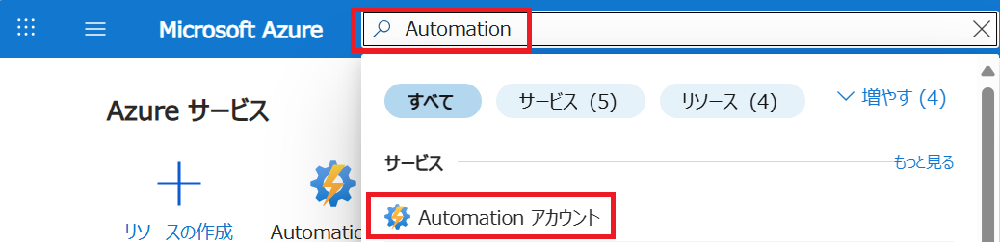
    </p>

    デプロイ済みのAzure Automationリソースのページへ移動します。
    <p>
      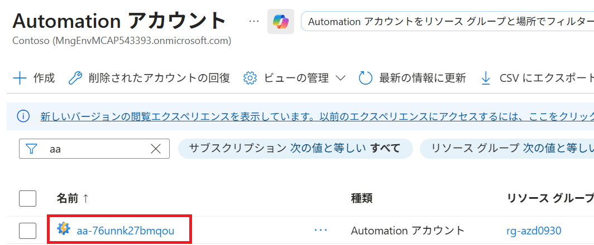
    </p>

2. Azure Automationのページの左ペインから Runbook を選択します。
    <p>
      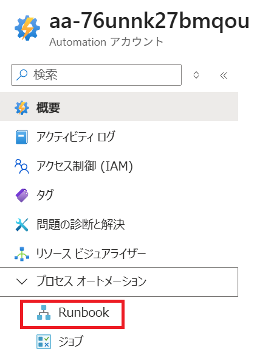
    </p>

    デプロイ完了直後は2つのRunbookが表示され、作成状態が "新規(New)" の状態です。  
    表示されているRunbookをクリックします。
    <p>
      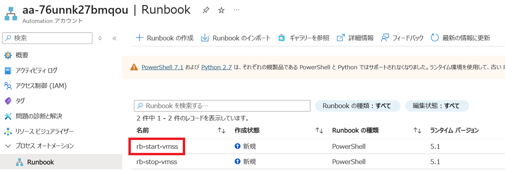
    </p>
3. 概要(Overview) -> 編集(Edit) -> ポータルで編集(Edit in Portal) を選択します。
    <p>
      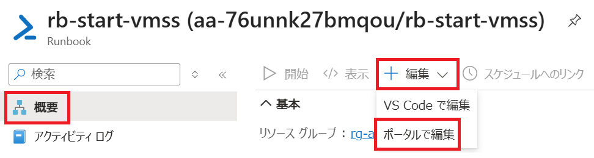
    </p>

4. スクリプトをキャンバスにコピー＆ペーストし、 "公開(Publish)" します。  
**※同じ作業を2つのRunbookに対して行います。**

    各Runbookの説明とスクリプト格納先は以下の通りです。

    | Runbook名 | 説明 | スクリプト格納パス |
    |--|--|--|
    |rb-start-vmss|VMSS起動用スクリプト|infra\core\automation\runbooks\runbook-start-vmss.ps1|
    |rb-stop-vmss|VMSS停止用スクリプト|infra\core\automation\runbooks\runbook-stop-vmss.ps1|

    <p>
      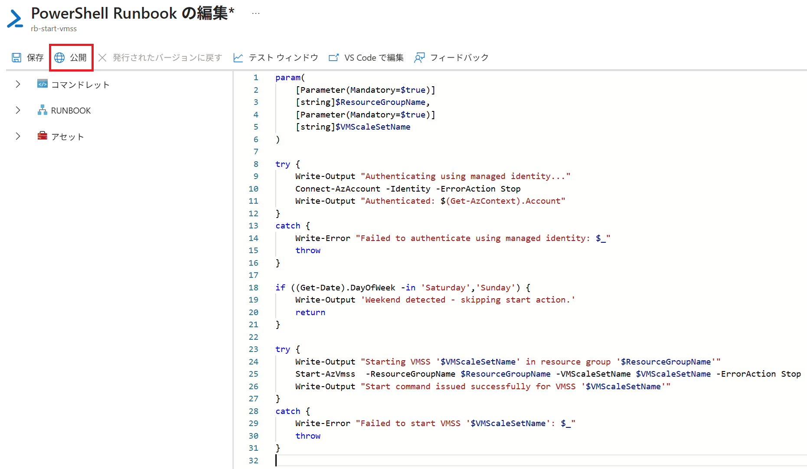
    </p>

5. Runbookの作成状態が、"発行済み(Published)" になっていることを確認します。
    <p>
      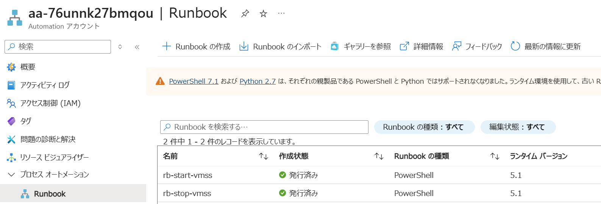
    </p>

### Runbook に対して自動実行スケジュールを設定する。
1. 次にスケジュールの設定を行います。
2. Automationリソースの左ペインから、スケジュール(Schedules) -> スケジュールの追加(Add a schedule)をクリックします。
**※VMSSの起動時と停止時の2つのスケジュールをご用意ください。**
    <p>
      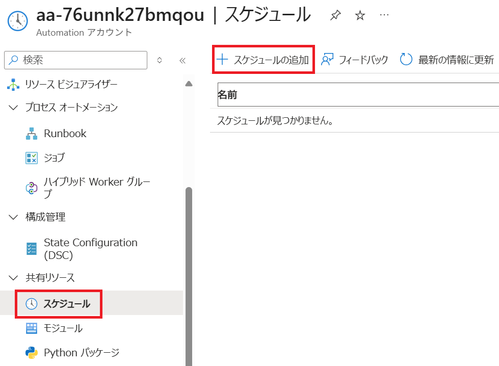
    </p>

    以下設定例ですが、ご要望の実行時間やタイミングに応じてご設定ください。  
    <p>
      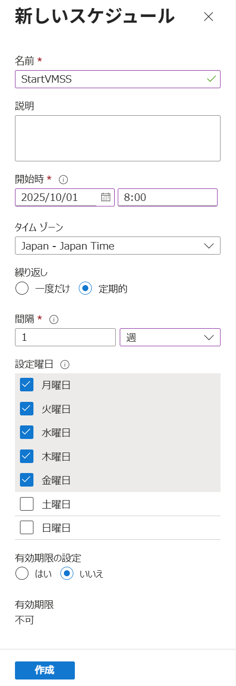
    </p>

3. Runbookとスケジュールの紐づけを行います。 各Runbookの概要(Overview) -> スケジュールのリンク(Link to schedule)をクリックします。
    <p>
      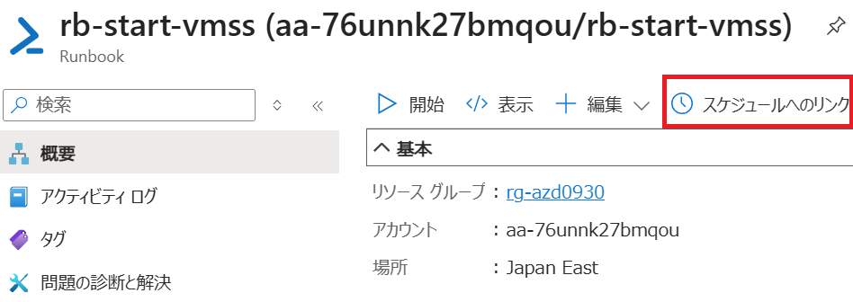
    </p>

4. 各Runbookと対応するスケジュールを選択します。
    <p>
      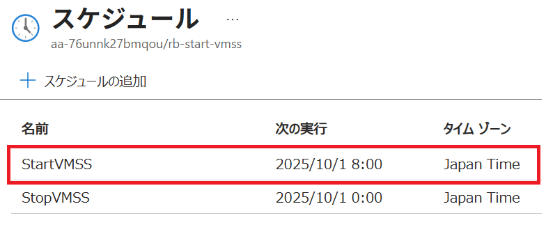
    </p>

5. パラメータ設定で、VMSSが所属するリソースグループ名とVMSSのリソース名を入力してください。
     <p>
      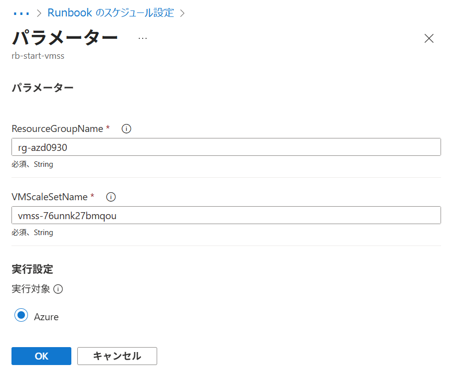
    </p>


6. VMSS開始用/停止用の2つのRunbookでスケジュールとパラメータの設定を行い作業完了です。


# 環境の削除

デプロイした環境を削除する場合は以下の手順を実行してください。

## 1. Azure Developer CLIによる環境削除

```bash
azd down
```

このコマンドにより、デプロイしたすべてのAzureリソースが削除されます。

> **Warning:**  
> この操作は元に戻すことができません。実行前に削除対象のリソースを十分に確認してください。

APIMとAzure OpenAIはソフトデリートされた状態となるため、完全に削除する場合は以下の質問に`y`を入力し、パージしてください。

```bash
These resources have soft delete enabled allowing them to be recovered for a period or time after deletion. During this period, their names may not be reused. In the future, you can use the argument --purge to skip this confirmation.
? Would you like to permanently delete these resources instead, allowing their names to be reused? (y/N) y
  (✓) Done: Purging apim: apim-xxxx
  (✓) Done: Purging Cognitive Account: cog-xxxx
```

> **Note:** 
> 最新のAzure Developer CLIでは`azd down`でリソース削除後パージまで実施できますが、過去のバージョンでは実施できない場合があります。その場合は、次のコマンドでパージできます。

* APIMパージコマンド
```bash
az apim deletedservice purge --service-name <apim_service_name> --location japaneast
```
* Azure OpenAIパージコマンド
```bash
az cognitiveservices account purge --name <aoai_service_name> --resource-group <resource_group_name> --location japaneast
```
# vLLM API - API仕様

本APIは、vLLMで稼働するモデルへのアクセスを提供します。`enablePlamoCustomApiTransform` パラメータにより、2つのモードを切り替えることができます。

## APIモードの切り替え

| enablePlamoCustomApiTransform | モード | 説明 |
|------------------------|--------|------|
| `true` | 変換モード | Plamo翻訳用のカスタムフォーマットでリクエスト/レスポンスを変換します |
| `false` | パススルーモード | vLLM OpenAI互換APIをそのまま受け流します |

---

## 変換モード（enablePlamoCustomApiTransform = true）

### エンドポイント

-   **Method:** `POST`
-   **URL:** `{APIMのURL}/vllm/v1/completions`

### 認証

HTTPリクエストヘッダーにAPIキーを指定します。

-   **Key:** `x-api-key`
-   **Value:** `{APIMのサブスクリプションキー}`

> **Note:**   
> APIMのサブスクリプションキーの発行・管理手順については以下を参照してください。スコープとして指定する製品は、```GenAI Product```を選択してください。    
> [Create subscriptions in Azure API Management](https://learn.microsoft.com/ja-jp/azure/api-management/api-management-howto-create-subscriptions)

### リクエスト形式

リクエストボディに指定するフィールドは以下の通りです

| 名前        | 型       | 必須 | 内容説明                                                                   | デフォルト値 | 設定例 |
|-------------|----------|------|--------------------------------------------------------------------------|--------------|--------|
| inputs.input_text       | string   | Yes  | モデルに与える入力文。翻訳や生成の指示を含みます。                     | なし         | 今日はいい天気です |
| inputs.option  | string  | Yes   | 翻訳元と翻訳先の言語を指定。日本語から英語の場合は```Jp2En```、英語から日本語の場合は```En2Jp```を指定します。                          | なし           | Jp2En |


### リクエスト例

日本語->英語
```bash
curl -X POST https://apim-xyz.azure-api.net/vllm/v1/completions \
  -H "Content-Type: application/json" -H "x-api-key: xxxxxxxxxxxxxxxxxxxxxxxxxxx" \
  -d '{"inputs": {"input_text": "今日はいい天気です", "option": "Jp2En"}}'
```

英語->日本語
```bash
curl -X POST https://apim-xyz.azure-api.net/vllm/v1/completions \
  -H "Content-Type: application/json" -H "x-api-key: xxxxxxxxxxxxxxxx" \
  -d '{"inputs": {"input_text": "Hi, this is a red pen.", "option": "En2Jp"}}'
```

VMSSが受け付ける以下のような形式のリクエストも可能です
```json
{
  "model": "pfnet/plamo-2-translate",
  "max_tokens": 1024,
  "temperature": 0,
  "stop": "<|plamo:op|>",
  "prompt": "<|plamo:op|>dataset translation <|plamo:op|>input lang=English Write the text to be translated here. <|plamo:op|>output lang=Japanese"
}
```

## レスポンス例

日本語->英語
```json
{"statusCode": 200,"outputs": "It's nice weather today."}
```

英語->日本語
```json
{"statusCode": 200,"outputs": "こちらは赤ペンです。"}
```

VMSS自体は以下の形式のレスポンスを返しており、これをAPIMで上記のような形に編集して返しております（200レスポンスの時のみ）
```json
{
  "id": "cmpl-bb461f5146d44d13bb2cb4296b719e34",
  "object": "text_completion",
  "created": 1758264203,
  "model": "pfnet/plamo-2-translate",
  "choices": [
    {
      "index": 0,
      "text": " ここに翻訳対象のテキストを入力してください。\n",
      "logprobs": null,
      "finish_reason": "stop",
      "stop_reason": "<|plamo:op|>",
      "prompt_logprobs": null
    }
  ],
  "service_tier": null,
  "system_fingerprint": null,
  "usage": {
    "prompt_tokens": 22,
    "total_tokens": 32,
    "completion_tokens": 10,
    "prompt_tokens_details": null
  },
  "kv_transfer_params": null
}
```

---

## パススルーモード（enablePlamoCustomApiTransform = false）

パススルーモードでは、vLLMのOpenAI互換APIをそのまま利用できます。リクエスト/レスポンスの変換は行われず、vLLMに直接リクエストが転送されます。

### 利用可能なエンドポイント

vLLMがサポートするOpenAI互換APIのエンドポイントを利用できます。詳細は [vLLM OpenAI Compatible Server](https://docs.vllm.ai/en/latest/serving/openai_compatible_server/) を参照してください。

-   **Completions:** `POST {APIMのURL}/vllm/v1/completions`
-   **Chat Completions:** `POST {APIMのURL}/vllm/v1/chat/completions`
-   **Models:** `GET {APIMのURL}/vllm/v1/models`

### 認証

HTTPリクエストヘッダーにAPIキーを指定します。

-   **Key:** `x-api-key`
-   **Value:** `{APIMのサブスクリプションキー}`

### リクエスト例（Completions）

```bash
curl -X POST https://apim-xyz.azure-api.net/vllm/v1/completions \
  -H "Content-Type: application/json" \
  -H "x-api-key: your-subscription-key" \
  -d '{
    "model": "pfnet/plamo-2-translate",
    "max_tokens": 1024,
    "temperature": 0,
    "stop": "<|plamo:op|>",
    "prompt": "<|plamo:op|>dataset translation <|plamo:op|>input lang=English Write the text to be translated here. <|plamo:op|>output lang=Japanese"
  }'
```

### レスポンス例（Completions）

```json
{
  "id": "cmpl-xxx",
  "object": "text_completion",
  "created": 1758264203,
  "model": "pfnet/plamo-2-translate",
  "choices": [
    {
      "index": 0,
      "text": "ここに翻訳対象のテキストを入力してください。",
      "finish_reason": "stop"
    }
  ],
  "usage": {
    "prompt_tokens": 22,
    "total_tokens": 32,
    "completion_tokens": 10
  }
}
```

---

# Azure OpenAI 直接API - API仕様

本システムでは、Azure OpenAIへ直接ルーティングされるOpenAI互換形式のAPIを提供しています。

## 共通認証

すべてのエンドポイントで、HTTPリクエストヘッダーにAPIキーを指定します。

-   **Key:** `x-api-key`
-   **Value:** `{APIMのサブスクリプションキー}`

---

## エンドポイント1: Chat Completions API

### 概要
-   **Method:** `POST`
-   **URL:** `{APIMのURL}/openai/v1/chat/completions`
-   **説明:** OpenAI互換形式のチャット補完API。Azure OpenAIへ直接ルーティングされます。

### リクエスト例

```bash
curl -X POST "https://apim-xyz.azure-api.net/openai/v1/chat/completions" \
  -H "Content-Type: application/json" \
  -H "x-api-key: your-subscription-key" \
  -d '{
    "model": "gpt-4o",
    "messages": [
      {"role": "system", "content": "You are a helpful assistant."},
      {"role": "user", "content": "What is the capital of France?"}
    ]
  }'
```

### レスポンス例

```json
{
  "choices": [
    {
      "finish_reason": "stop",
      "index": 0,
      "message": {
        "content": "The capital of France is Paris.",
        "role": "assistant"
      }
    }
  ],
  "created": 1764584192,
  "id": "chatcmpl-...",
  "model": "gpt-4o-2024-11-20",
  "object": "chat.completion",
  "usage": {
    "completion_tokens": 8,
    "prompt_tokens": 25,
    "total_tokens": 33
  }
}
```

---

## エンドポイント2: Responses API

### 概要
-   **Method:** `POST`
-   **URL:** `{APIMのURL}/openai/v1/responses`
-   **説明:** OpenAI互換形式のResponses API。構造化出力やJSON Schemaに対応したレスポンス生成が可能です。

### リクエスト例

```bash
curl -X POST "https://apim-xyz.azure-api.net/openai/v1/responses" \
  -H "Content-Type: application/json" \
  -H "x-api-key: your-subscription-key" \
  -d '{
    "model": "gpt-4o",
    "instructions": "You are a helpful assistant.",
    "input": "What is 2+2?"
  }'
```

### レスポンス例

```json
{
  "id": "resp_...",
  "object": "response",
  "created_at": 1764584192,
  "status": "completed",
  "model": "gpt-4o",
  "output": [
    {
      "type": "message",
      "content": [
        {
          "type": "output_text",
          "text": "2 + 2 equals 4!"
        }
      ],
      "role": "assistant"
    }
  ],
  "usage": {
    "input_tokens": 24,
    "output_tokens": 11,
    "total_tokens": 35
  }
}
```

---

# Azure OpenAI Code Interpreter - API仕様

本APIは、Azure FunctionsでホスティングされたCode Interpreter機能を提供します。

## エンドポイント

-   **Method:** `POST`
-   **URL:** `{APIMのURL}/code-interpreter/responses`
-   **説明:** Azure OpenAIのCode Interpreter機能を利用したデータ分析・可視化API

## 認証

HTTPリクエストヘッダーにAPIキーを指定します。

-   **Key:** `x-api-key`
-   **Value:** `{APIMのサブスクリプションキー}`

## リクエスト形式

リクエストボディに指定するフィールドは以下の通りです

| 名前        | 型       | 必須 | 内容説明                                                                   | デフォルト値 | 設定例 |
|-------------|----------|------|--------------------------------------------------------------------------|--------------|--------|
| inputs.input_text       | string   | Yes  | モデルに与える入力文。分析の具体的な指示を行います。                     | なし         | カテゴリごとの平均価格を計算し、横棒グラフで可視化してください。 |
| inputs.files.key  | string  | Yes   |  源内の標準的なI/Fに合わせるため指定。本APIでは使用していないため、空文字でも問題ないです。                         | なし           | excel_file |
| inputs.files.files.filename | string    | No   | 分析対象のファイル名を指定。                    | なし            | sample_data1.xlsx |
| inputs.files.files.content | string    | No   | 分析対象のファイル名をBase64文字列にエンコードしたテキストを指定。                    | なし            | iVBORw0K... |

## リクエスト例

```json
{
  "inputs": {
    "input_text": "カテゴリごとの平均価格を計算し、横棒グラフで可視化してください。",
    "files": [
      {
        "key": "excel_file",
        "files": [
          {
            "filename": "sample_data1.xlsx",
            "content": "<base64_data>"
          },
          {
            "filename": "sample_data2.xlsx",
            "content": "<base64_data>"
          }
        ]
      }
    ]
  }
}
```

## レスポンス例

```json
{
    "outputs": "カテゴリごとの平均価格を計算し、横棒グラフで可視化しました。グラフを見ると、「電子機器」カテゴリが最も高い平均価格を示しています。",
    "artifacts": [
        {
            "display_name": "cfile_691d8b5458288190886a3909acc28933.png",
            "content": "<base64_data>"
        }
    ]
}
```

# メトリクスやログについて

メトリクスはAzure MonitorやApplication Insightsで確認できます。

* Azure Monitorの確認: API Managementインスタンスの監視 > メトリックから確認可能です。

* Application Insightsの確認: 本テンプレートで作成したリソースグループに存在するApplication Insightsから確認可能です。

リクエストしたログはLog Analytics Workspaceに保存されています。

* Log Analytics Workspaceの確認: API Managementインスタンスの監視 > ログ から確認可能です。例えば、```infra/main.parameters.json```の```enableGenAiIoLogging```を```true```にした場合、ApiManagementGatewayLogsテーブルに対し以下のようなKQLを発行することで直近3日間のログを取得できます。リクエストBody、レスポンスBody、（BackendRequestHeader内に)ユーザーIDなどが含まれていることをご確認ください
    ```
    ApiManagementGatewayLogs | where TimeGenerated > ago(3d)
    ```

# VMSS VMへのアクセスとトラブルシューティング

VMSSのVM内で操作やメンテナンスを行う場合や、デプロイ後にAPIが正常に動作しない場合のトラブルシューティング方法を説明します。

## VMへのアクセス準備

### 1. パスワード認証の有効化

``infra/main.parameters.json``の`enableVmssPasswordAuth`を`true`に設定してデプロイします。

```json
"enableVmssPasswordAuth": {
  "value": true
}
```

### 2. ブート診断の有効化

Azure PortalでVMSSのブート診断を有効化します。

1. Azure Portalで該当のVMSSリソースを開きます
2. 左メニューから **サポート + トラブルシューティング** > **ブート診断** を選択します
3. **設定** タブで **マネージド ストレージ アカウントで有効にする** を選択し、保存します

### 3. シリアルコンソールからVMにログイン

1. VMSSリソースの **インスタンス** から対象のVMインスタンスを選択します
2. 左メニューから **サポート + トラブルシューティング** > **シリアル コンソール** を選択します
3. コンソールが表示されたら、Enterキーを押してログインプロンプトを表示します
4. ユーザー名（デフォルト: `azureuser`）とパスワード（`VMSS_ADMIN_CREDENTIAL`の値）を入力してログインします

## トラブルシューティング

デプロイ後、Application Gatewayのバックエンド正常性が異常で動作しない場合は、以下の手順でログを確認してください。

### cloud-initログの確認

VMの初期セットアップはcloud-initで実行されます。エラーがないか確認します。

```bash
# cloud-init全体のログ
cat /var/log/cloud-init.log

# cloud-initの出力ログ（コマンド実行結果など）
cat /var/log/cloud-init-output.log
```

### post-reboot.shの実行ログ

再起動後に実行されるスクリプトのログを確認します。

```bash
# post-reboot.shの実行ログ
cat /var/log/post-reboot.log
```

### vLLMコンテナのログ確認

vLLMコンテナが正常に起動しているか、モデルのロードに問題がないか確認します。

```bash
# コンテナの状態を確認
docker ps -a

# vLLMコンテナのログを確認（コンテナ名: vllm-server）
docker logs vllm-server

# リアルタイムでログを追跡
docker logs -f vllm-server
```

### CUDA ドライバー/ランタイム不整合エラー

vLLMコンテナ起動時に以下のようなエラーが発生する場合、VM上のNVIDIAドライバー（CUDA Toolkit）のバージョンとコンテナイメージが要求するCUDAランタイムのバージョンが不一致です。

#### 代表的なエラーメッセージ

```
RuntimeError: CUDA error: system has unsupported display driver / cuda driver combination
CUDA kernel errors might be asynchronously reported at some other API call...
Error 803: system has unsupported display driver / cuda driver combination
```

または `nvidia-smi` は正常でも、コンテナ内でGPUが認識できない場合も同様の原因が考えられます。

#### 原因

VMの `ubuntu-drivers install` で自動インストールされるNVIDIAドライバーは最新版（例: Driver 590.x / CUDA 13.1）になる場合があります。一方、vLLMコンテナイメージ `vllm/vllm-openai:latest` が内部でビルドされたCUDAランタイムのバージョン（例: CUDA 12.x）が、ホスト側ドライバーのCUDAバージョンと互換性がない場合にこのエラーが発生します。

> **Note:** CUDAはドライバーの前方互換性を持ちます。ホスト側CUDAバージョン ≧ コンテナ側CUDAバージョンであれば動作しますが、ホスト側が大幅に新しい場合やコンテナ側が古い場合に互換性が失われることがあります。

#### 確認手順

シリアルコンソールにログインし、以下のコマンドでバージョンを確認します。

```bash
# ホスト側のNVIDIAドライバーとCUDAバージョンを確認
nvidia-smi

# コンテナ内のCUDAバージョンを確認（コンテナが起動している場合）
docker exec vllm-server nvcc --version
```

`nvidia-smi` の右上に表示される **CUDA Version** がホスト側のバージョンです。コンテナ側のCUDAバージョンと比較して互換性を確認してください。

#### 解決方法：vLLMコンテナイメージタグの変更

ホスト側のCUDAバージョンに対応したvLLMコンテナイメージに変更します。

**手順1:** `infra/main.parameters.json` の `vllmContainerImage` を適切なイメージタグに変更します。

```json
"vllmContainerImage": {
  "value": "vllm/vllm-openai:v0.15.1-cu130"
}
```

> **利用可能なイメージタグの例：**
>
> | タグ | 対応CUDA | 用途 |
> |------|----------|------|
> | `latest` | ビルド時点のデフォルト | 通常利用（CUDAバージョン不明の場合は注意） |
> | `v0.15.1-cu130` | CUDA 13.0 | ホスト側 CUDA 13.x ドライバー環境向け |
> | `v0.15.1` | CUDA 12.x | ホスト側 CUDA 12.x ドライバー環境向け |
>
> 最新のタグ一覧は [Docker Hub: vllm/vllm-openai](https://hub.docker.com/r/vllm/vllm-openai/tags) で確認できます。

**手順2:** 再デプロイを実行します。

```bash
azd provision
```

**手順3:** 既存のVMSSインスタンスには新しい cloud-init は反映されません。以下のいずれかの方法で反映してください。

- **インスタンスの再イメージ化（推奨）:** Azure Portal で VMSS > インスタンス > 該当インスタンスを選択 > **再イメージ化** を実行
- **スケールイン/アウト:** インスタンス数を 0 に縮小した後、再度スケールアウトして新しいインスタンスを作成

# 参考情報

## APIMポリシーカスタマイズガイド

Azure API Managementのポリシーをカスタマイズして、OpenAI互換APIから独自のリクエスト/レスポンス形式に変換する方法を解説します。APIMポリシーの詳細なカスタマイズ方法については、以下のドキュメントを参照してください。

→ [APIMポリシーカスタマイズガイド](docs/APIM_POLICY_CUSTOMIZATION_GUIDE.md)

## vLLMコンテナへのPythonライブラリ追加

VMSS上で稼働する`vllm/vllm-openai`Dockerコンテナに追加のPythonライブラリをインストールしたい場合は、以下のファイルにパッケージ名を記載してください。

**ファイルパス:** `infra/core/vmss/cloudinit/requirements.txt`

```
# 例: 追加したいライブラリを1行ずつ記載
scipy
transformers==4.48.2
```

このファイルに記載されたライブラリは、VMの初期セットアップ時（cloud-init実行時）にDockerコンテナ内へ`pip install`されます。新しいライブラリを追加した場合は、再デプロイ（`azd provision`）を実行し、VMを再作成してください。

## 第三者ライセンス

本プロジェクトにはNoto Sans JP（源ノ角ゴシック）フォント（© 2014-2021 Adobe）が含まれます。
当フォントはSIL Open Font License 1.1の下で提供されています。詳細は`app/font/OFL.txt`を参照してください。