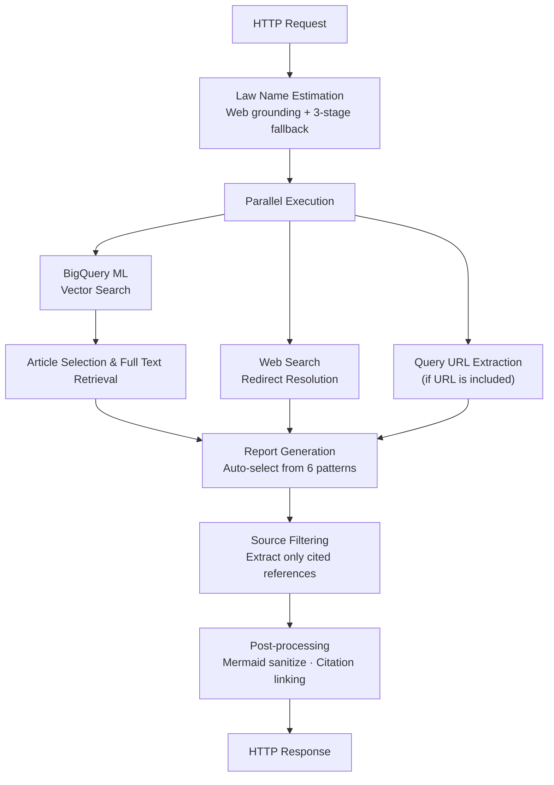

[日本語](README.md) | English

# Lawsy-Custom-BQ

A serverless API system that receives legal queries, analyzes intent with AI, and dynamically generates optimized reports. It combines BigQuery ML vector search with Gemini to search and generate answers using Japanese legislation data (e-Gov).

## Table of Contents

- [Technology Stack](#technology-stack)
- [Features](#features)
- [Processing Flow](#processing-flow)
- [Input/Output Examples](#inputoutput-examples)
- [Deployment](#deployment)
- [Safety Considerations](#safety-considerations)
- [Background](#background)
- [Documentation](#documentation)
- [Registration with GENAI](#registration-with-genai)

## Technology Stack

- **Backend**: Python (Google Cloud Functions)
- **AI Model**: Google Vertex AI (Gemini 2.5 Flash)
- **Data Source**: BigQuery ML Vector Search + Gemini Web Grounding
- **Infrastructure**: Google Cloud (API Gateway, Cloud Functions, BigQuery ML)
- **IaC**: Terraform

## Features

1. **Legislation Search**: High-speed search of relevant legislation using BigQuery ML vector search
2. **Report Generation**: Determines query intent and selects optimal structure from 6 patterns, generating a comprehensive report in a single AI call (see [report section definitions: prompts.py](modules/api/functions/src/prompts.py))
3. **Source Management**: Organizes and displays only referenced sources that are actually cited

## Processing Flow



### Step 1: Law Name Estimation & Search

- Estimates relevant law names using Web grounding (with 3-stage fallback)
- Expands search scope by supplementing enforcement orders and enforcement regulations
- Retrieves articles using BigQuery ML vector search (parallel web search also executed)

### Step 2: Article Selection & Complete Report Generation

- AI selects relevant articles and retrieves full text
- Automatically selects optimal structure from 6 patterns based on query intent (see [pattern definitions: prompts.py L14-19](modules/api/functions/src/prompts.py))
- Integrates search results and generates Markdown report in one call

### Step 3: Source Filtering & Post-processing

- Extracts only sources that are actually cited
- Organizes as clickable links
- Sanitizes Mermaid diagrams, externalizes citation links

### Data Management (3-layer structure)

- **Source Layer**: Raw legal XML data
- **DWH Layer**: Historical data for all versions
- **App Layer**: Latest data for API use (with vector indexes)

## Input/Output Examples

> **Note:** This API is designed to query Japanese legislation. While input queries can be in any language, all responses are generated in Japanese.

### Input Example

```bash
URL="https://your-gateway-url"
API_KEY="your-api-key"
DATA='{"inputs": {"input_text": "デジタル社会形成基本法における「デジタル社会」の定義を教えてください"}}'

curl -X POST \
     -H "Content-Type: application/json" \
     -H "x-api-key: ${API_KEY}" \
     -d "${DATA}" \
     "${URL}"
```

### Output Example

> **Note:** API responses are always generated in Japanese, regardless of the input language.

```markdown
# 質問: "デジタル社会形成基本法における「デジタル社会」の定義を教えてください"

## 定義の明確化

デジタル社会形成基本法第2条において、「デジタル社会」は次のように定義されています。

「インターネットその他の高度情報通信ネットワークを通じて自由かつ安全に多様な情報や知識を世界的規模で入手し、共有し、又は発信するとともに、人工知能、IoT（Internet of Things）その他のデジタル技術を活用して、多様な分野における創造的かつ活力ある発展が可能となる社会」

## 法的根拠

🔗[[1]](https://elaws.e-gov.go.jp/document?lawid=503AC0000000035) デジタル社会形成基本法第2条第1号

## 関連概念

この定義は以下の要素を含んでいます：
- 高度情報通信ネットワークの活用
- 情報の自由で安全な流通
- 人工知能・IoT 等のデジタル技術の活用
- 多様な分野での創造的発展

## 実務への影響

デジタル社会の実現に向けて、各省庁や地方自治体においてDX推進が求められています...

（中略）

## 参考情報

🔗[デジタル社会形成基本法](https://elaws.e-gov.go.jp/document?lawid=503AC0000000035)
🔗[デジタル庁設置法](https://elaws.e-gov.go.jp/document?lawid=503AC0000000036)
```

## Deployment

### Prerequisites

The following Google Cloud services must be enabled:

| Service | Purpose |
|---------|---------|
| Cloud Functions | API Backend |
| API Gateway | Endpoint exposure & API key authentication |
| BigQuery / BigQuery ML | Legislation data storage & vector search |
| Vertex AI | Embedding model (BigQuery ML integration) |
| Cloud Storage | Data pipeline intermediate files |

Required permissions: Project Owner or Administrator roles for the above services

### Preliminary Setup

1. **Install Terraform**
   ```bash
   # For macOS
   brew install terraform
   ```

2. **Install Google Cloud SDK**
   ```bash
   # For macOS
   brew install google-cloud-sdk
   ```

3. **Configure Google Cloud Authentication**
   ```bash
   gcloud auth login

   # Configure application default credentials
   gcloud auth application-default login
   ```

### Data Preparation

**Important**: Before deploying the API, you must prepare legislation data in BigQuery.

#### Automated Pipeline Execution (Recommended)

After downloading XML data, all preparation is completed with the following single command:

```bash
./preprocess/run_entire_pipeline.sh \
  <project_id> \
  <dataset_id> \
  <xml_files_directory> \
  <gcs_bucket_name> \
  <gcs_blob_name> \
  <region> \
  <connection_name> \
  <date_tag>

# Example:
./preprocess/run_entire_pipeline.sh \
  my-project-id \
  e_laws_search \
  ./xml_files \
  my-bucket \
  laws.jsonl \
  asia-northeast1 \
  vertex-ai-connection \
  20250925
```

**This pipeline automatically executes:**
- BigQuery dataset & table creation
- BQML embedding model creation
- DWH layer & App layer construction
- Vector index creation

### Deployment Steps

1. **Create Environment Configuration**

   Copy `envs/sample/` to create your own environment directory and edit each file.

   ```bash
   cp -r envs/sample envs/my-env
   ```

   The bucket name in `backend.tf` must be unique across all of Google Cloud.

   Edit `locals.tf`:
   ```hcl
   locals {
     project_id     = "your-gcp-project-id"       # Google Cloud project ID
     project_number = "your-project-number"         # Google Cloud project number
     dataset_id     = "e_laws_search"               # BigQuery dataset ID
     allowed_ip_addresses = [                       # API access allowed IPs
       "xxx.xxx.xxx.xxx/32"
     ]

     # Gemini settings
     gemini_settings = {
       inference_project_id          = "your-project-id"
       inference_location            = "asia-northeast1"
       model_id                      = "gemini-2.5-flash"
       generation_temperature        = "0.0"
       generation_max_output_tokens  = "65535"
       generation_top_p              = "0.95"
       generation_top_k              = "40"
       generation_candidate_count    = "1"
       generation_system_instruction = ""
     }
   }
   ```

2. **BigQuery Connection Configuration**

   A BigQuery connection is required to use Vertex AI models with BigQuery ML.

   #### Method 1: Using Google Cloud Console (GUI)

   1. Open BigQuery in the Google Cloud Console
   2. In the "Explorer" panel, select "**+ ADD**" → "**Connect to external data source**"
   3. Connection type: Select "**Vertex AI remote models, remote functions, and BigLake tables**"
   4. Enter `vertex-ai-connection` as the connection ID
   5. Copy the generated **Service Account ID**
   6. Grant the "Vertex AI User" role to that service account in IAM
   7. Click "Create connection"

   #### Method 2: Using gcloud CLI

   ```bash
   # Create BigQuery connection
   bq mk --connection --location=asia-northeast1 --project_id=your-project-id \
          --connection_type=CLOUD_RESOURCE vertex-ai-connection

   # Confirm generated service account
   bq show --connection --project_id=your-project-id --location=asia-northeast1 vertex-ai-connection

   # Grant Vertex AI User permission
   gcloud projects add-iam-policy-binding your-project-id \
     --member="serviceAccount:SERVICE_ACCOUNT_ID" \
     --role="roles/aiplatform.user"
   ```

   Replace `SERVICE_ACCOUNT_ID` with the `serviceAccountId` value displayed by the above command.

3. **Adjust Service Configuration** (as needed)

   Adjust CPU and memory settings in `service_config` of `./modules/api/main.tf`.

4. **Execute Deployment**
   ```bash
   cd envs/my-env

   terraform init
   terraform plan
   terraform apply
   ```

### Post-deployment Verification

```bash
# Check endpoint URL
echo "Gateway URL: $(terraform output -raw gateway_url)"

# Check API Key ID (retrieve value from Google Cloud Console > API keys)
echo "API Key ID: $(terraform output -raw api_key_id)"
```

## Safety Considerations

### About Gemini SafetySettings

This system sets all Gemini API `SafetySettings` to `BLOCK_NONE`.

Japanese legislation contains many articles that **prohibit** dangerous acts and discriminatory expressions. These are easily misjudged as harmful content by AI safety filters, and enabling filtering causes legitimate legal information to be lost. Therefore, we implement content control through system prompts rather than `SafetySettings`.

### Guardrails Implemented Through System Prompts

Content quality and appropriateness are controlled through system prompts ([`prompts.py`](modules/api/functions/src/prompts.py)).

- **Role Limitation**: Defines the model as a "specialized system for responding to legal queries"
- **Ensuring Accuracy**: "Do not speculate on uncertain content; document only definitive information"
- **Mandatory Citations**: Structured output format requiring article numbers and source documentation

## Background

This administrative AI application was developed based on Lawsy, which won the [Grand Prize at the 2025 "Legislation" × "Digital" Hackathon](https://digital-agency-news.digital.go.jp/articles/2025-04-03) held at the Digital Agency, Government of Japan. However, because certain APIs were not available within the Japanese Government Cloud (a standardized cloud infrastructure adopted by the Government of Japan) environment, a direct port was not feasible. Considering the improved performance of generative AI itself and advice from administrative officials at the Digital Agency, we proceeded with enhancements that resulted in a completely different internal implementation.

### Major Changes

1. Dynamically create report sections (examples are provided to the generative AI)
2. Use only law names for legislation search, not article information
3. Provide the generative AI with complete legal text as much as possible

### Background of Changes

#### Dynamically Creating Report Sections (with Examples Provided to LLM)

Since legal queries are diverse, it's difficult to completely fix report sections. However, having completely different report sections generated each time is inconvenient for users, so we provide section examples to the generative AI when generating reports.

Example categories ([source code: prompts.py L14-19](modules/api/functions/src/prompts.py)):
```
Definition Inquiry (定義確認型: "デジタル社会形成基本法における「デジタル社会」の定義を教えてください")
Procedural Inquiry (手続き確認型: "行政手続きのデジタル化において、本人確認はどのような手順で行われますか？")
Comparative Analysis (比較検討型: "個人情報保護法と行政機関個人情報保護法の適用範囲の違いを比較して")
Interpretation & Application (解釈適用型: "AIを活用した行政サービスにおいて、個人情報保護法第27条の「利用目的の変更」はどのように解釈されますか？")
Policy Research (政策研究型: "デジタル田園都市国家構想における地方自治体のDX推進について、法的課題と政策的な解決策を分析してください")
Comprehensive Analysis (包括分析型: "日本のデジタル・ガバメント政策について、関連法制度を包括的に分析し、今後の展望を教えてください")
```

Thanks to improved generative AI performance, providing these examples alone now generates reports with reasonably appropriate sections.

#### Using Only Law Names for Legislation Search, Not Article Information

Statutory provisions frequently use relative references such as "the preceding paragraph," "the two preceding paragraphs," and "the following paragraph." Therefore, typical chunking methods commonly used in RAG, combined with standard information retrieval techniques (term search using morphological analysis or n-grams, or similarity using vector dot products of embedding representations) do not work well.

On the other hand, having generative AI estimate candidate law names from user query content works well in most cases. Even with this approach, challenges remain: (1) lack of knowledge about the latest legislation, and (2) inaccurate LLM knowledge preventing accurate law name estimation. However, we address these challenges through innovations like (1) combining with web search and (2) using embedding representations for law name search to be robust against notation variations.

This also greatly depends on the improved performance of generative AI itself, including increased knowledge and integration with web search.

#### Providing LLM with Complete Legal Text as Much as Possible

Since statutory provisions frequently contain relative references like "the preceding paragraph," "the two preceding paragraphs," and "the following paragraph," information in only part of a law may not be sufficient for answering. While methods like extracting articles in a range with sufficient information are conceivable, we adopted an approach of inputting the full text to generative AI that supports long context windows.

This choice also became possible due to improved generative AI performance, specifically longer supported context windows.

However, for very long laws exceeding 180 articles like the [Act on the Protection of Personal Information](https://laws.e-gov.go.jp/law/415AC0000000057), it is difficult to input the full text to generative AI. In such cases, we adopt a two-stage method of extracting only likely relevant sections based on table of contents information.

## Documentation

| Purpose | Document |
|---------|----------|
| Understand overall system specifications | [docs/総合仕様書.md](docs/総合仕様書.md) (Japanese) |
| Verify BigQuery data schema | [docs/development_plan_and_bq_schema.md](docs/development_plan_and_bq_schema.md) (Japanese) |
| Configure BigQuery × Vertex AI connection | [docs/bq_connection_guide.md](docs/bq_connection_guide.md) (Japanese) |
| Build BQML pipeline | [docs/bqml_embedding_guide.md](docs/bqml_embedding_guide.md) (Japanese) |
| Verify post-deployment operation | [docs/verification_guide.md](docs/verification_guide.md) (Japanese) |
| Register API with GENAI | [docs/govai_registration.md](docs/govai_registration.md) (Japanese) |
| Automate data updates | [preprocess/README_automation.md](preprocess/README_automation.md) (Japanese) |
| Understand Japanese legal XML structure | [preprocess/法令の条文構造と法令XML.md](preprocess/法令の条文構造と法令XML.md) (Japanese) |

## Registration with GENAI

> **Note**: This section contains information about operations internal to the Digital Agency, Government of Japan.

For procedures and parameters to register the API with GENAI after deployment, refer to [`docs/govai_registration.md`](docs/govai_registration.md).

## License

For the license of this project, please refer to the LICENSE file in the repository root.
