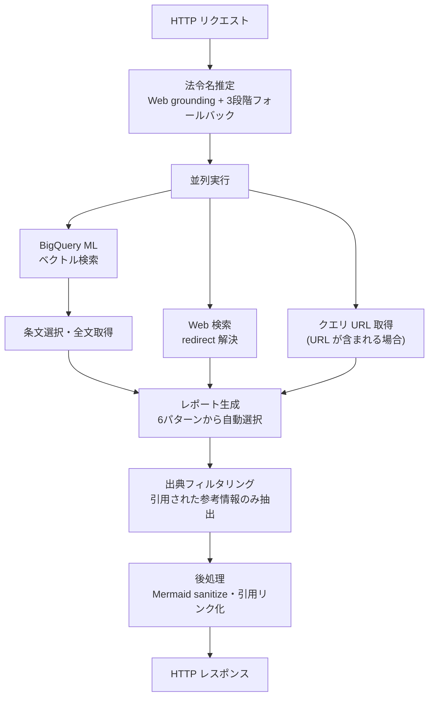

日本語 | [English](README.en.md)

# Lawsy-Custom-BQ

法令に関する質問を受け取り、AIが意図を解析して最適化されたレポートを動的に生成するサーバーレス API システムです。BigQuery ML のベクトル検索と Gemini を組み合わせ、日本の法令データ（e-Gov）を対象とした検索・回答生成を行います。

## 目次

- [技術スタック](#技術スタック)
- [機能](#機能)
- [処理の流れ](#処理の流れ)
- [入出力例](#入出力例)
- [デプロイ方法](#デプロイ方法)
- [安全設計について](#安全設計について)
- [背景](#背景)
- [ドキュメント構成](#ドキュメント構成)
- [源内への登録](#源内への登録)

## 技術スタック

- **バックエンド**: Python (Google Cloud Functions)
- **AI モデル**: Google Vertex AI (Gemini 2.5 Flash)
- **データソース**: BigQuery ML ベクトル検索 + Gemini Web Grounding
- **インフラ**: Google Cloud (API Gateway, Cloud Functions, BigQuery ML)
- **IaC**: Terraform

## 機能

1. **法令検索**: BigQuery ML のベクトル検索で関連法令を高速検索
2. **レポート生成**: クエリの意図を判断して6パターンから最適な構造を選び、包括的なレポートを1回の AI 呼び出しで生成（[レポート項目の定義: prompts.py](modules/api/functions/src/prompts.py)）
3. **出典管理**: 実際に引用された参考情報のみを整理して表示

## 処理の流れ



### Step 1: 法令名推定・検索

- Web grounding で関連法令名を推定（3段階フォールバック付き）
- 施行令・施行規則を補完して検索対象を拡張
- BigQuery ML ベクトル検索で条文を取得（並列で Web 検索も実行）

### Step 2: 条文選択と完全レポート生成

- AI が関連条文を選択し、全文を取得
- クエリの意図から6パターンの最適な構造を自動選択（[パターン定義: prompts.py L14-19](modules/api/functions/src/prompts.py)）
- 検索結果を統合し Markdown レポートを1回で生成

### Step 3: 出典フィルタリングと後処理

- 実際に引用された参考情報のみを抽出
- クリック可能なリンク形式で整理
- Mermaid 図表の sanitize、引用リンクの外部リンク化

### データ管理（3層構造）

- **Source 層**: 生の法令 XML データ
- **DWH 層**: 全バージョンの履歴データ
- **App 層**: API 用の最新データ（ベクトルインデックス付き）

## 入出力例

### 入力例

```bash
URL="https://your-gateway-url"
API_KEY="your-api-key"
DATA='{"inputs": {"input_text": "デジタル社会形成基本法における「デジタル社会」の定義を教えてください"}}'

curl -X POST \
     -H "Content-Type: application/json" \
     -H "x-api-key: ${API_KEY}" \
     -d "${DATA}" \
     "${URL}"
```

### 出力例

```markdown
# 質問: "デジタル社会形成基本法における「デジタル社会」の定義を教えてください"

## 定義の明確化

デジタル社会形成基本法第2条において、「デジタル社会」は次のように定義されています。

「インターネットその他の高度情報通信ネットワークを通じて自由かつ安全に多様な情報や知識を世界的規模で入手し、共有し、又は発信するとともに、人工知能、IoT（Internet of Things）その他のデジタル技術を活用して、多様な分野における創造的かつ活力ある発展が可能となる社会」

## 法的根拠

🔗[[1]](https://elaws.e-gov.go.jp/document?lawid=503AC0000000035) デジタル社会形成基本法第2条第1号

## 関連概念

この定義は以下の要素を含んでいます：
- 高度情報通信ネットワークの活用
- 情報の自由で安全な流通
- 人工知能・IoT 等のデジタル技術の活用
- 多様な分野での創造的発展

## 実務への影響

デジタル社会の実現に向けて、各省庁や地方自治体においてDX推進が求められています...

（中略）

## 参考情報

🔗[デジタル社会形成基本法](https://elaws.e-gov.go.jp/document?lawid=503AC0000000035)
🔗[デジタル庁設置法](https://elaws.e-gov.go.jp/document?lawid=503AC0000000036)
```

## デプロイ方法

### 前提条件

以下の GCP サービスが有効化されている必要があります。

| サービス | 用途 |
|---------|------|
| Cloud Functions | API バックエンド |
| API Gateway | エンドポイント公開・API キー認証 |
| BigQuery / BigQuery ML | 法令データ格納・ベクトル検索 |
| Vertex AI | 埋め込みモデル（BigQuery ML 連携） |
| Cloud Storage | データパイプライン中間ファイル |

必要な権限: プロジェクトオーナーまたは上記サービスの管理者ロール

### 事前準備

1. **Terraform のインストール**
   ```bash
   # macOS の場合
   brew install terraform
   ```

2. **Google Cloud SDK のインストール**
   ```bash
   # macOS の場合
   brew install google-cloud-sdk
   ```

3. **Google Cloud の認証設定**
   ```bash
   gcloud auth login

   # アプリケーションデフォルト認証情報の設定
   gcloud auth application-default login
   ```

### データ準備

**重要**: API デプロイ前に、BigQuery に法令データを準備する必要があります。

#### 自動パイプライン実行（推奨）

XML データのダウンロード後、以下の1コマンドで全ての準備が完了します：

```bash
./preprocess/run_entire_pipeline.sh \
  <project_id> \
  <dataset_id> \
  <xml_files_directory> \
  <gcs_bucket_name> \
  <gcs_blob_name> \
  <region> \
  <connection_name> \
  <date_tag>

# 例：
./preprocess/run_entire_pipeline.sh \
  my-project-id \
  e_laws_search \
  ./xml_files \
  my-bucket \
  laws.jsonl \
  asia-northeast1 \
  vertex-ai-connection \
  20250925
```

**このパイプラインが自動実行する内容：**
- BigQuery データセット・テーブル作成
- BQML embedding model の作成
- DWH 層・App 層の構築
- ベクトルインデックスの作成

### デプロイ手順

1. **環境設定の作成**

   `envs/sample/` をコピーして自環境のディレクトリを作成し、各ファイルを編集してください。

   ```bash
   cp -r envs/sample envs/my-env
   ```

   `backend.tf` のバケット名は Google Cloud 全体でユニークである必要があります。

   `locals.tf` を編集:
   ```hcl
   locals {
     project_id     = "your-gcp-project-id"       # GCP プロジェクト ID
     project_number = "your-project-number"         # GCP プロジェクト番号
     dataset_id     = "e_laws_search"               # BigQuery データセット ID
     allowed_ip_addresses = [                       # API アクセス許可 IP
       "xxx.xxx.xxx.xxx/32"
     ]

     # Gemini 設定
     gemini_settings = {
       inference_project_id          = "your-project-id"
       inference_location            = "asia-northeast1"
       model_id                      = "gemini-2.5-flash"
       generation_temperature        = "0.0"
       generation_max_output_tokens  = "65535"
       generation_top_p              = "0.95"
       generation_top_k              = "40"
       generation_candidate_count    = "1"
       generation_system_instruction = ""
     }
   }
   ```

2. **BigQuery 接続設定**

   BigQuery ML で Vertex AI モデルを使用するための Connection 設定が必要です。

   #### 方法1: Google Cloud コンソール（GUI）を使用

   1. Google Cloud コンソールで BigQuery を開く
   2. 「エクスプローラ」パネルの「**＋追加**」→「**外部データソースへの接続**」を選択
   3. 接続タイプ: 「**Vertex AI リモートモデル、リモート関数、BigLake テーブル**」を選択
   4. 接続 ID に `vertex-ai-connection` を入力
   5. 生成された**サービスアカウント ID** をコピー
   6. IAM で「Vertex AI ユーザー」ロールをそのサービスアカウントに付与
   7. 「接続を作成」をクリック

   #### 方法2: gcloud CLI を使用

   ```bash
   # BigQuery 接続を作成
   bq mk --connection --location=asia-northeast1 --project_id=your-project-id \
          --connection_type=CLOUD_RESOURCE vertex-ai-connection

   # 生成されたサービスアカウントを確認
   bq show --connection --project_id=your-project-id --location=asia-northeast1 vertex-ai-connection

   # Vertex AI User 権限を付与
   gcloud projects add-iam-policy-binding your-project-id \
     --member="serviceAccount:SERVICE_ACCOUNT_ID" \
     --role="roles/aiplatform.user"
   ```

   `SERVICE_ACCOUNT_ID` は上のコマンドで表示される `serviceAccountId` の値に置き換えてください。

3. **サービス設定の調整**（必要に応じて）

   `./modules/api/main.tf` の `service_config` で CPU・メモリ設定を調整します。

4. **デプロイの実行**
   ```bash
   cd envs/my-env

   terraform init
   terraform plan
   terraform apply
   ```

### デプロイ後の確認

```bash
# エンドポイント URL を確認
echo "Gateway URL: $(terraform output -raw gateway_url)"

# API Key ID を確認（値は Google Cloud Console > APIキー から取得）
echo "API Key ID: $(terraform output -raw api_key_id)"
```

## 安全設計について

### Gemini SafetySettings について

本システムでは Gemini API の `SafetySettings` をすべて `BLOCK_NONE` に設定しています。

法令には危険行為・差別的表現の**禁止**を規定する条文が多数含まれます。これらは AI の安全フィルターが有害コンテンツと誤判定しやすく、フィルタリングを有効にすると正当な法令情報が欠落します。そのため、コンテンツの制御は `SafetySettings` ではなくシステムプロンプトで行う設計にしています。

### ガードレールはシステムプロンプトで実装

コンテンツの品質・適切性の制御は、システムプロンプト（[`prompts.py`](modules/api/functions/src/prompts.py)）で行っています。

- **役割の限定**: モデルを「法令クエリに回答する専門システム」として定義
- **正確性の担保**: 「不確実な内容は推測せず、確実な情報のみを記載」
- **引用の強制**: 条文番号・出典を明記させる構造化された出力形式

## 背景

この行政実務用AIアプリは、デジタル庁で2025年に行われた[「法令」×「デジタル」ハッカソンの最優秀賞](https://digital-agency-news.digital.go.jp/articles/2025-04-03)に選ばれた Lawsy を基に開発を進めました。しかし、ガバメントクラウド完結をするために利用できない API がある等、そのままの移植では困難であった点や、生成 AI 自体の性能向上、デジタル庁の行政官の助言等を受けながらエンハンスを進めた結果、中身は全くの別物となりました。

### 大きな変更点

1. レポートの項目を動的に作成する（生成 AI に例示は与える）
2. 法令検索時に条文の情報は用いず、法令名のみを用いる
3. 生成 AI に法令全文を可能な限り与える

### 変更の背景

#### レポートの項目を動的に作成する（LLMに例示は与える）

法令に関する質問は多岐にわたるためレポート項目を固定しきるのは難しいです。
一方で、毎回生成されるレポート項目がバラバラになるのは利用者に不便なので、生成 AI でレポートを生成させるさいに項目の例示を与えています。

例示の類型（[ソースコード: prompts.py L14-19](modules/api/functions/src/prompts.py)）
```
定義確認型 ("デジタル社会形成基本法における「デジタル社会」の定義を教えてください")
手続き確認型 ("行政手続きのデジタル化において、本人確認はどのような手順で行われますか？")
比較検討型 ("個人情報保護法と行政機関個人情報保護法の適用範囲の違いを比較して")
解釈適用型 ("AIを活用した行政サービスにおいて、個人情報保護法第27条の「利用目的の変更」はどのように解釈されますか？")
政策研究型 ("デジタル田園都市国家構想における地方自治体のDX推進について、法的課題と政策的な解決策を分析してください")
包括分析型 ("日本のデジタル・ガバメント政策について、関連法制度を包括的に分析し、今後の展望を教えてください")
```

生成 AI 自体の性能向上もあり、例示を与えるだけで、だいぶそれらしい項目でのレポートが作成されるようになりました。

#### 法令検索時に条文の情報は用いず、法令名のみを用いる

法令の条文には、「前項」、「前二項」、「次項」のような相対表記が頻出します。
そのため、いわゆるRAGでよく使われる文章分割（チャンキング）したものに一般的な情報検索の手法（形態素解析やn-gramのようなターム検索や、埋め込み表現を用いたベクトル内積の類似度等）を用いてもうまく検索ができません。
一方で、利用者の質問の内容から該当しそうな法令名の候補を生成 AI に推定させると多くのケースでうまくいきます。この場合でも(1)最新の法令の知識がない、(2)LLMの知識が不正確で正確な法令名を推定できない、といった課題はありますが、それら課題に対しても(1)Web検索を組み合わせる(2)法令名の検索に埋め込み表現を用いて表記揺れ等に強くする、といった工夫を加えています。

こちらも生成 AI の知識量向上やWeb検索との連動といった、生成 AI 自体の性能向上に依るところが大きいです。

#### LLMに法令全文を可能な限り与える

法令の条文には、「前項」、「前二項」、「次項」のような相対表記が頻出することから、法令の一部だけでは回答に十分な情報が含まれないことがあります。十分情報が含まれる範囲で条文を抽出する、といった手法も考えられますが、長いコンテキストウインドウをサポートする生成 AI に全文を入れるといったアプローチを採用しています。

こちらもサポートするコンテキストウィンドウが長くなった、という生成 AI 自体の性能向上の結果、このような選択を取れるようになりました。

しかし、[個人情報の保護に関する法律](https://laws.e-gov.go.jp/law/415AC0000000057) のように百八十条を超える長大な法律の場合、全文を生成 AI に入力することは難しいため、そのような場合は目次の情報から、該当しそうな箇所のみ抽出する、といった2段階の方法を採用しています。

## ドキュメント構成

| 目的 | ドキュメント |
|------|------------|
| システム全体の仕様を理解する | [docs/総合仕様書.md](docs/総合仕様書.md) |
| BigQuery データスキーマを確認する | [docs/development_plan_and_bq_schema.md](docs/development_plan_and_bq_schema.md) |
| BigQuery × Vertex AI 接続を設定する | [docs/bq_connection_guide.md](docs/bq_connection_guide.md) |
| BQML パイプラインを構築する | [docs/bqml_embedding_guide.md](docs/bqml_embedding_guide.md) |
| デプロイ後の動作を確認する | [docs/verification_guide.md](docs/verification_guide.md) |
| 源内にAPIを登録する | [docs/govai_registration.md](docs/govai_registration.md) |
| データ更新を自動化する | [preprocess/README_automation.md](preprocess/README_automation.md) |
| 日本法令 XML の構造を理解する | [preprocess/法令の条文構造と法令XML.md](preprocess/法令の条文構造と法令XML.md) |

## 源内への登録

> **Note**: このセクションはデジタル庁内部での運用に関する情報です。

デプロイ後に源内へ API を登録する手順・パラメータは [`docs/govai_registration.md`](docs/govai_registration.md) を参照してください。

## ライセンス

このプロジェクトのライセンスについては、リポジトリルートの LICENSE ファイルを参照してください。
